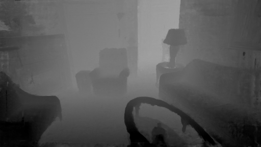
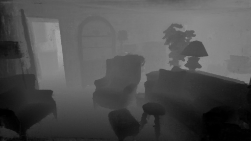
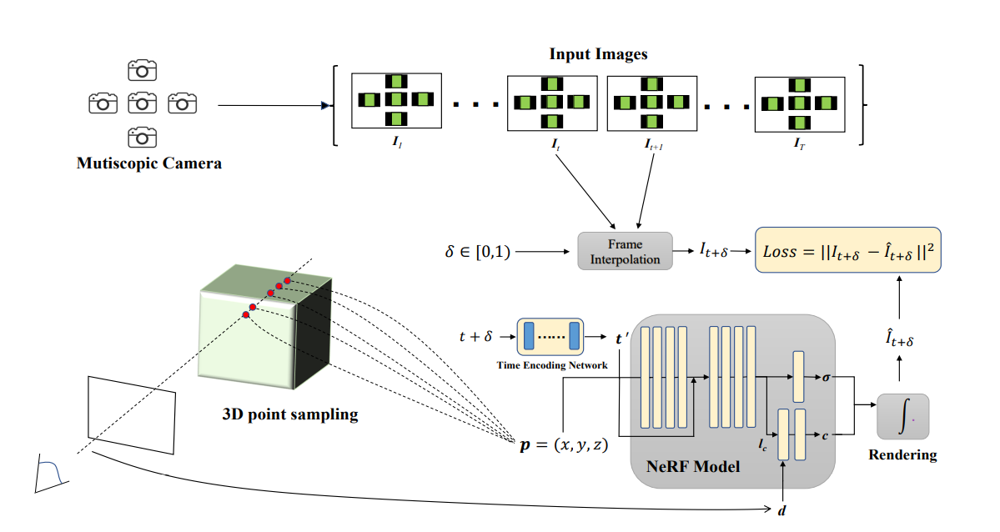
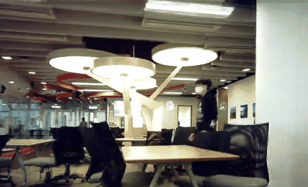

# A Portable Multiscopic Camera for Novel View and Time Synthesis in Dynamic Scenes (IROS 2022)

Our implementation is based on [nerfmm(PyTorch)](https://github.com/ActiveVisionLab/nerfmm)

> A Portable Multiscopic Camera for Novel View and Time Synthesis in Dynamic Scenes  
> https://yuenfuilau.github.io/

<!--Update: We released the inference code and the pre-trained model on Oct. 31. The training code is coming soon.   
Update: We provided a Colab notebook for play.  
Update: We released the training code. -->


[paper](pending-for-release) | [supp.](pending-for-release) | [project website](https://yuenfuilau.github.io/) | [demo video](https://www.youtube.com/watch?v=IUmy1LBCVhc) 

          

        

## Introduction
We present a portable multiscopic camera system with a dedicated model for novel view and time synthesis in dynamic scenes. Our goal is to render high-quality images for a dynamic scene from any viewpoint at any time using our portable multiscopic camera. To achieve such novel view and time synthesis, we develop a physical multiscopic camera equipped with five cameras to train a neural radiance field (NeRF) in both time and spatial domains for dynamic scenes.

  

## To Do
- [ ] Release the inference code
- [ ] Release the pretrained model
- [ ] Writing Descriptions
- [x] Release the training code 

## Set up
### Installation
```
git clone https://github.com/YuenFuiLau/A-Portable-Multiscopic-Camera-for-Novel-View-and-Time-Synthesis-in-Dynamic-Scenes.git
cd A-Portable-Multiscopic-Camera-for-Novel-View-and-Time-Synthesis-in-Dynamic-Scenes
```

### Environment
The environment can be simply set up from the provided `environment.yml`:

```
conda env create -f environment.yml
```

## More Results
          

        

## Acknowledgement
Thanks to [nerfmm(PyTorch)](https://github.com/ActiveVisionLab/nerfmm) for sharing their code.
